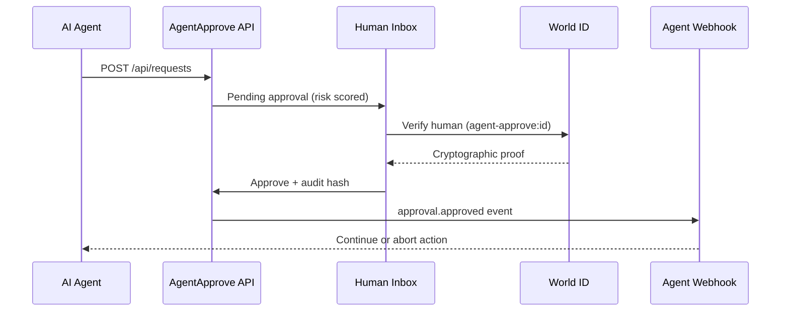

# AgentApprove

**Human-in-the-Loop approval dashboard for AI agents** — a [World Mini App](https://docs.world.org/mini-apps) that pauses high-stakes agent actions until a real human approves them with **World ID**.

When an AI agent wants to pay, sign a transaction, deploy code, or call a paid API, AgentApprove surfaces the request in your inbox. You approve with a cryptographic World ID proof bound to that specific action (`agent-approve:{requestId}`), or reject it. Every decision is logged with a SHA-256 audit hash and your agent gets a webhook callback.

Built for the [World Foundation Spark Grant](https://world.org/grants) and aligned with [World Human-in-the-Loop / AgentKit](https://docs.world.org/agents/human-in-the-loop/integrate).

**Live demo:** [agent-approve-beryl.vercel.app](https://agent-approve-beryl.vercel.app/) · **License:** MIT · **Status:** Pre-traction — open-source reference implementation for World developers

---

## Why AgentApprove?

AI agents are increasingly autonomous — booking flights, signing transactions, deploying contracts, and spending on APIs. Without a human checkpoint, a misaligned or compromised agent can move money or data before anyone notices.

AgentApprove is the **consumer-facing trust layer** on top of World’s agent infrastructure:

| Problem | AgentApprove answer |
|--------|---------------------|
| Agent wants to spend $842 on a flight | Request appears in inbox; human approves with World ID |
| High-value or deploy actions need stronger assurance | Risk engine flags medium/high risk; Orb verification required when needed |
| Agents need to know the outcome | Webhook fires on approve/reject with audit hash |
| Compliance & accountability | Full audit log with action-bound proofs and timestamps |

---

## How it works



1. **Agent submits** a request via `POST /api/requests` (optionally authenticated with `x-agent-api-key`).
2. **Risk engine** assigns low / medium / high risk and whether Orb verification is required.
3. **Human reviews** the request in the World Mini App inbox.
4. **Approve** triggers World ID verification bound to `agent-approve:{requestId}`.
5. **Audit log** records the decision with a SHA-256 approval hash.
6. **Webhook** notifies the agent at its callback URL.

---

## Features

### Inbox & approvals
- Pending queue for `payment`, `sign`, `deploy`, and `api_call` actions
- Approve with World ID (IDKit + RP signature) or reject instantly
- Action-bound verification — each approval is tied to one request ID
- Haptic feedback on approve (World App)

### Agent registry
- Register linked agents with optional webhook URLs
- Per-agent daily spend limits (display)
- Stats bar: pending count, today’s approvals/rejections, total resolved

### Risk scoring
| Condition | Risk | Orb required |
|-----------|------|--------------|
| Deploy action | High | Yes |
| Sign action | Medium | No |
| Payment ≥ $500 | High | Yes |
| Payment ≥ $100 | Medium | Yes |
| Small payment / API call | Low | No |

### Developer experience
- **Demo tab** — simulate agent requests without an external agent
- **Integrate page** — in-app integration guide
- **Agent API** — REST endpoints for headless agents
- **18 automated tests** — store, API, risk, full approve/reject flow
- **Live simulation script** — end-to-end test against a running dev server

### World stack integration
- MiniKit 2.0 + World ID (IDKit)
- NextAuth wallet session
- World Credit API trust badge (when wallet connected)
- Built on the official `@worldcoin/create-mini-app` template

---

## Quick start

### Prerequisites
- Node.js 20+
- [World Developer Portal](https://developer.world.org/) account (for World ID in production)
- [World App](https://world.org/world-app) on your phone (for live testing)

### Local development

```bash
git clone https://github.com/panagot/AgentApprove.git
cd AgentApprove
npm install
cp .env.sample .env.local
npm run dev
```

Open [http://localhost:3000](http://localhost:3000).

### Environment variables

Copy `.env.sample` to `.env.local` and fill in:

| Variable | Required | Description |
|----------|----------|-------------|
| `NEXT_PUBLIC_APP_ID` | Yes | Mini App ID from Developer Portal (`app_...`) |
| `RP_ID` | Yes | Relying party ID (`rp_...`) |
| `RP_SIGNING_KEY` | Yes | RP signing key for IDKit |
| `AUTH_SECRET` | Yes | Session secret — `openssl rand -base64 32` |
| `HMAC_SECRET_KEY` | Yes | HMAC key — `openssl rand -base64 32` |
| `AUTH_URL` | Yes | Public app URL (localhost, ngrok, or Vercel) |
| `AUTH_TRUST_HOST` | Local | Set `true` for ngrok / proxy testing |
| `AGENT_API_KEY` | Optional | Protects `POST /api/requests` when set |

Generate secrets:

```bash
openssl rand -base64 32   # AUTH_SECRET
openssl rand -base64 32   # HMAC_SECRET_KEY
```

---

## Test in World App

World ID verification only works inside World App — not in a desktop browser alone.

1. Run the dev server: `npm run dev`
2. Expose locally with [ngrok](https://ngrok.com): `ngrok http 3000`
3. Set `AUTH_URL` in `.env.local` to your ngrok HTTPS URL
4. In [Developer Portal](https://developer.world.org/), set the Mini App URL to the same ngrok URL
5. Scan the QR code in World App → open AgentApprove
6. Use the **Demo** tab to create a request, then approve from **Inbox**

---

## Agent API

### Create an approval request

```bash
curl -X POST https://agent-approve-beryl.vercel.app/api/requests \
  -H "Content-Type: application/json" \
  -H "x-agent-api-key: YOUR_KEY" \
  -d '{
    "agentName": "Travel Agent",
    "actionType": "payment",
    "summary": "Book flight SFO → Tokyo",
    "amount": "$842.00",
    "target": "united.com/checkout",
    "callbackUrl": "https://your-agent.example/webhook"
  }'
```

**Action types:** `payment` | `sign` | `deploy` | `api_call`

**Response:** `201` with `{ "request": { "id": "...", "status": "pending", ... } }`

### List requests

```bash
curl "https://agent-approve-beryl.vercel.app/api/requests?status=pending"
```

### Webhook payload (on approve/reject)

```json
{
  "event": "approval.approved",
  "requestId": "req_abc123",
  "status": "approved",
  "worldIdVerified": true,
  "approvalHash": "sha256:...",
  "timestamp": "2026-05-22T12:00:00.000Z",
  "request": {
    "agentName": "Travel Agent",
    "actionType": "payment",
    "summary": "Book flight SFO → Tokyo",
    "amount": "$842.00",
    "target": "united.com/checkout"
  }
}
```

### Other endpoints

| Method | Path | Description |
|--------|------|-------------|
| `GET` | `/api/agents` | List registered agents |
| `POST` | `/api/agents` | Register an agent |
| `POST` | `/api/requests/:id/approve` | Approve (World ID proof) |
| `POST` | `/api/requests/:id/reject` | Reject request |
| `GET` | `/api/stats` | Dashboard statistics |
| `GET` | `/api/credit/:address` | World Credit profile |

See the in-app **Integrate** page (`/integrate`) for full integration examples.

---

## Testing

```bash
# Unit + integration tests (18 scenarios)
npm test

# Live end-to-end simulation (dev server must be running)
npm run dev          # terminal 1
npm run test:live    # terminal 2

# Production build check
npm run build
```

Tests cover: risk scoring, approval hashes, agent registry, request CRUD, webhook dispatch, API validation, and simulated approve/reject flows.

World ID verification in World App is manual — not covered by automated tests.

---

## Deploy to Vercel

[](https://vercel.com/new/clone?repository-url=https://github.com/panagot/AgentApprove)

1. Import [panagot/AgentApprove](https://github.com/panagot/AgentApprove) on Vercel
2. Add all environment variables from the table above
3. Set `AUTH_URL` to your Vercel production URL (e.g. `https://agent-approve-beryl.vercel.app`)
4. Deploy
5. Update the Mini App URL in [Developer Portal](https://developer.world.org/) to match

> **Demo note:** Data is stored in a JSON file under `/tmp` on Vercel (ephemeral per serverless instance). Fine for demos and grant submissions; use Postgres or another persistent store for production.

---

## Project structure

```
agent-approve/
├── src/
│   ├── app/
│   │   ├── (protected)/     # Inbox, agents, history, demo, integrate
│   │   └── api/             # REST API routes
│   ├── components/          # UI: ApprovalCard, InboxList, StatsBar, …
│   ├── lib/
│   │   ├── store.ts         # JSON file persistence
│   │   ├── risk.ts          # Risk scoring engine
│   │   ├── webhook.ts       # Agent callback delivery
│   │   └── audit.ts         # SHA-256 approval hashes
│   └── auth/                # NextAuth + wallet helpers
├── tests/                   # Vitest suite
├── scripts/simulate-live.mjs
└── SPARK_APPLICATION.md     # Grant application draft
```

---

## Grant alignment (Spark Track)

- Extends World’s **AgentKit / Human-in-the-Loop** launch (Apr 2026)
- Consumer-facing layer on developer infrastructure — not another tap game
- Deep **World ID** integration with action-bound proofs per approval
- **Non-airdrop utility** — real trust layer for the agentic web
- Measurable usage: approvals, rejections, registered agents, audit events

See [SPARK_APPLICATION.md](./SPARK_APPLICATION.md) for the full grant write-up.

---

## Roadmap

- [ ] Persistent storage (Postgres / Supabase) for production
- [ ] Push notifications for pending approvals in World App
- [ ] Multi-user / team inbox with role-based permissions
- [ ] Agent SDK npm package (`@agentapprove/client`)
- [ ] Spending policies and auto-reject rules

---

## License

MIT
